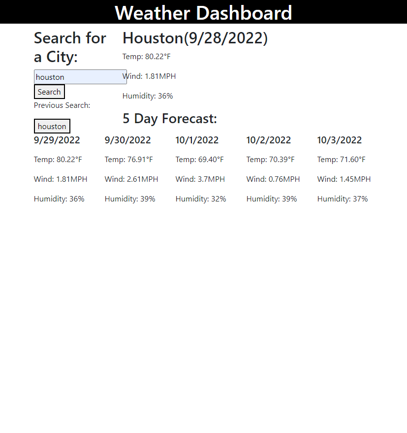

# Weather-Dashboard

## Description
When you search for a city you will be presented with the current and future conditions for that city. Then you are presented with the temperature, wind speed, and the humidity for that city. You will see the five day forecast for that city with the same values. When you search for another city you will be precented with the same values for that city.
## Link 

<a href="https://ivabon.github.io/06-weather/">link to website </a>

## Screenshot 

